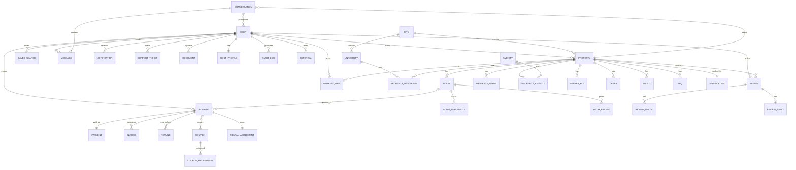
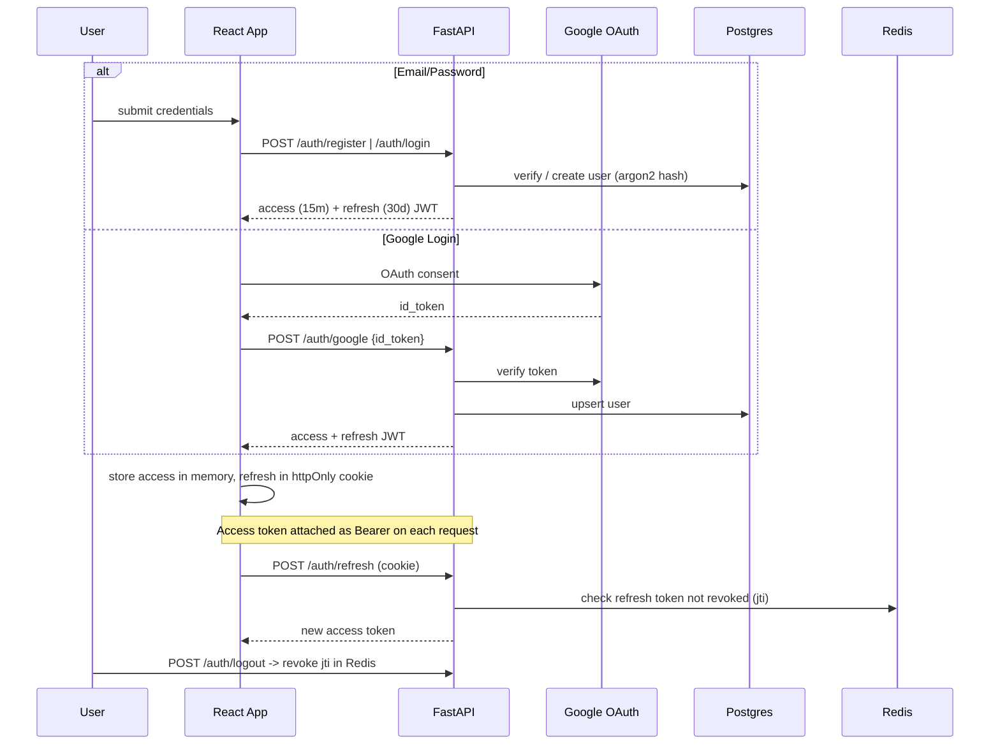
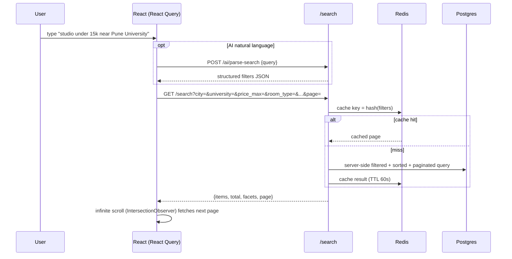
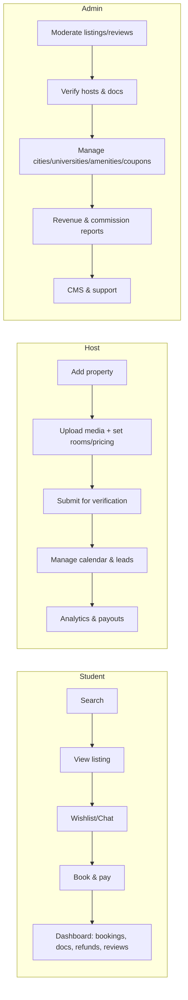
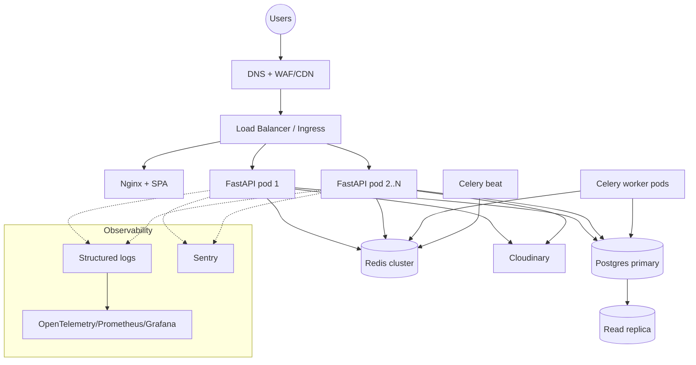

# UniNest — System Architecture

## 1. High-Level Architecture

```mermaid
flowchart TB
    subgraph Client["Client (Browser / PWA)"]
        UI["React + TS SPA<br/>Tailwind · React Query · Router · Framer Motion"]
        SW["Service Worker<br/>(Web Push)"]
    end

    subgraph Edge["Edge / CDN"]
        CDN["Cloudinary CDN<br/>(images, video, 360 tours)"]
        NGX["Nginx / Reverse Proxy<br/>TLS · gzip · static"]
    end

    subgraph API["Application Tier"]
        FA["FastAPI (ASGI/uvicorn)<br/>REST + WebSocket"]
        WS["WebSocket hub<br/>(chat, typing, presence)"]
    end

    subgraph Workers["Async Tier"]
        CEL["Celery Workers"]
        BEAT["Celery Beat<br/>(rent/move-in reminders)"]
    end

    subgraph Data["Data Tier"]
        PG[("PostgreSQL<br/>primary + read replica")]
        RD[("Redis<br/>cache · queue · rate-limit · pub/sub")]
    end

    subgraph External["External Services"]
        GO["Google OAuth"]
        GM["Google Maps / Places"]
        TW["Twilio (SMS/WhatsApp)"]
        SG["Email (SMTP/SendGrid)"]
        LLM["LLM Provider (AI)"]
        PAY["Payment Gateway"]
    end

    UI -->|HTTPS| NGX --> FA
    UI <-->|WSS| WS
    UI --> CDN
    SW <-. push .- FA
    FA --> PG
    FA --> RD
    FA --> CDN
    FA --> GO & GM & LLM & PAY
    FA -->|enqueue| RD
    CEL --> RD
    CEL --> PG
    CEL --> TW & SG & CDN
    BEAT --> RD
    WS <--> RD
```

### Tiers

- **Client** — Single-page app (Vite build) served via CDN/Nginx; a service worker handles Web Push.
- **Edge** — Nginx terminates TLS, serves static assets, reverse-proxies `/api` and `/ws`. Cloudinary serves all media over its global CDN with on-the-fly transformations.
- **Application** — Stateless FastAPI processes (horizontally scalable behind a load balancer). WebSocket endpoints back messaging/presence using Redis pub/sub so any node can deliver.
- **Async** — Celery workers process email/SMS/WhatsApp/push, invoice generation, image post-processing, AI embedding, and scheduled reminders (Beat).
- **Data** — PostgreSQL for the source of truth (with a read replica for search/analytics), Redis for caching, rate limiting, Celery broker/result backend, and pub/sub.

---

## 2. Module → Component Mapping

| Module | Backend | Frontend |
|--------|---------|----------|
| 1. Landing | `api/v1/discovery.py`, `services/discovery.py` | `features/landing/*` |
| 2. Advanced Search | `api/v1/search.py`, `services/search.py` | `features/search/*` |
| 3. Property Listing | `api/v1/properties.py` | `features/property/*` |
| 4. Room Types | `models/room.py` (`RoomType` enum) | shared types |
| 5. Booking | `api/v1/bookings.py`, `services/booking.py`, `services/payment.py` | `features/booking/*` |
| 6. Student Dashboard | `api/v1/students.py` | `pages/student/*` |
| 7. Host Dashboard | `api/v1/host.py`, `services/analytics.py` | `pages/host/*` |
| 8. Admin Dashboard | `api/v1/admin.py` | `pages/admin/*` |
| 9. Messaging | `api/v1/messaging.py` (WS), `services/chat.py` | `features/messaging/*` |
| 10. Reviews | `api/v1/reviews.py` | `features/reviews/*` |
| 11. Verification | `api/v1/verification.py`, `services/verification.py` | admin/host panels |
| 12. Maps | `services/maps.py` + Google Maps JS | `components/map/*` |
| 13. AI | `api/v1/ai.py`, `services/ai.py` | `features/ai/*` |
| 14. Notifications | `services/notifications/*`, `workers/tasks.py` | `features/notifications/*` |
| 15. Security | `core/security.py`, `core/rate_limit.py`, `core/deps.py`, `models/audit.py` | auth guards |
| 16. Performance | pagination + Redis cache + Cloudinary + infinite scroll | React Query + IntersectionObserver |
| 17. Future | `models/future.py` (scaffolded tables), feature flags | feature-flagged UI |

---

## 3. Entity-Relationship Diagram



Full column-level DDL is in [`DATABASE.md`](DATABASE.md).

---

## 4. Authentication Flow



- **Access token**: short-lived (15 min), sent as `Authorization: Bearer`.
- **Refresh token**: long-lived (30 days), rotated on use, stored server-side by `jti` in Redis for revocation.
- **RBAC roles**: `student`, `host`, `admin`, `support`. Enforced via FastAPI dependencies.

---

## 5. Search Flow



Server-side filtering covers all 30+ filters; results include **facets** (counts per filter) so the UI can show live counts. Distance/commute uses PostGIS-style haversine on stored lat/lng plus Google Distance Matrix (cached) for commute time.

---

## 6. Booking Flow

```mermaid
sequenceDiagram
    participant S as Student
    participant FE as React
    participant API as /bookings
    participant DB as Postgres
    participant PAY as Payment Gateway
    participant Q as Celery/Redis

    S->>FE: select room + dates
    FE->>API: POST /bookings/quote {room_id, dates, coupon}
    API->>DB: check RoomAvailability (live inventory)
    API-->>FE: quote {rent, deposit, cleaning, taxes, discount, total}
    S->>FE: confirm + sign agreement + upload docs
    FE->>API: POST /bookings {..., idempotency_key}
    API->>DB: BEGIN; lock inventory (SELECT ... FOR UPDATE); status=pending
    API->>PAY: create payment intent
    API-->>FE: client_secret
    FE->>PAY: confirm payment
    PAY-->>API: webhook payment_succeeded
    API->>DB: status=confirmed; decrement inventory; COMMIT
    API->>Q: enqueue invoice + confirmation email/WhatsApp/push
    API-->>FE: booking confirmed
    Note over API,DB: Cancellation -> refund calc by policy -> Refund row -> gateway refund -> release inventory
```

Inventory integrity is guaranteed by row-level locks and an idempotency key to prevent double-booking on retries.

---

## 7. Student / Host / Admin Flows



---

## 8. Deployment Architecture



**Environments:** `dev` (docker-compose) → `staging` → `production`. Twelve-factor config via env vars/secrets manager. Blue-green or rolling deploys. DB migrations gated in CI (`alembic upgrade head`) before switching traffic.

**Scaling levers:** stateless API pods (HPA on CPU/RPS), Redis for hot caches, Postgres read replicas for search/analytics, Cloudinary for media offload, Celery autoscaling for spikes (booking confirmations, reminder batches).

---

## 9. CI/CD Pipeline

```mermaid
flowchart LR
    PR[Pull Request] --> L[Lint: ruff + eslint + tsc]
    L --> UT[Unit tests: pytest + vitest]
    UT --> INT[Integration: Postgres+Redis services]
    INT --> B[Build images]
    B --> SCAN[Trivy image scan]
    SCAN --> PUSH[Push to registry]
    PUSH --> DEPS[Deploy staging]
    DEPS --> E2E[Playwright e2e]
    E2E --> PROD{{Manual approval}}
    PROD --> DEPP[Deploy production + alembic migrate]
```



Defined in [`.github/workflows/ci.yml`](../.github/workflows/ci.yml).

---

## 10. Security & Performance Summary

**Security (Module 15):** Argon2 password hashing, JWT access/refresh with rotation + revocation, RBAC dependencies, Redis token-bucket rate limiting, Pydantic input validation, Cloudinary + server-side image MIME/size validation, audit logs on sensitive actions, CORS allowlist, security headers via Nginx, secrets from env only.

**Performance (Module 16):** cursor/offset pagination, Redis response caching with tag invalidation, Cloudinary CDN + responsive `f_auto,q_auto` transforms, server-side filtering, DB indexes on all filter/sort columns, React Query caching + prefetching, image lazy loading, infinite scroll, code-splitting per route.
